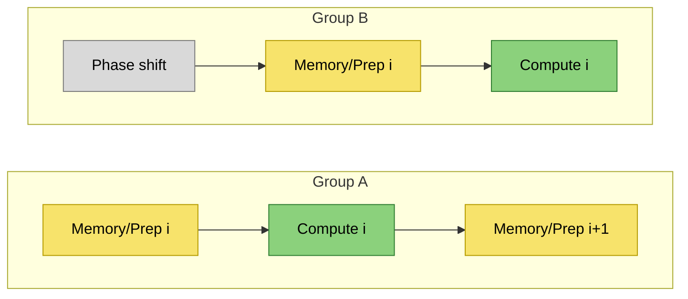
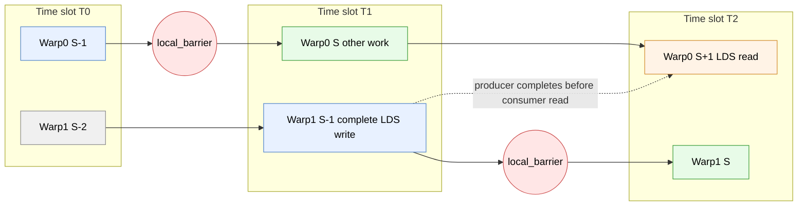
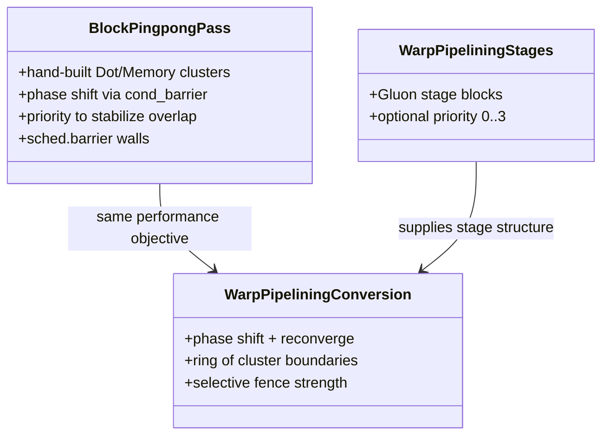

# Warp-pipelining in Triton AMDGPU

Author: Jungwook Park

Note: This document is under revision and may contain incorrect information.

## Executive Summary

Warp-pipelining in the provided Triton AMDGPU repository is a **phase-shifted, barrier-rendezvous scheduling scheme** designed to increase **MFMA/WMMA compute utilization** in compute-bound GEMM-like kernels. It does this by forcing two warp-/wave-groups within a work-group to remain **out of phase**: while one group executes a **compute stage (MFMA-heavy)**, the other executes a **memory/prep stage (loads, LDS traffic, address updates, waits)**, then they swap. The key enabler is a *partial synchronization primitive*, `amdg.cond_barrier`, which Triton defines as a conditional execution barrier that **does not set any memory fence** and requires explicit reconvergence.

The earlier BlockPingpong pass in the repo provides the clearest intent statements and concrete scheduling patterns. Its comments explain: (a) the goal is to “interleav[e]” two warps, (b) to separate “Dot and Memory clusters,” (c) to use `s_setprio` and conditional barriers for synchronization, and (d) that it primarily targets **compute-bound** regimes and relies on software pipelining rather than “improving memory latency itself.” (Repo: `third_party/amd/lib/TritonAMDGPUTransforms/BlockPingpong.cpp:L29-L37`.)

This report focuses first on **phase shift barrier rendezvous**, then analyzes the relevant BlockPingpong variants (**two**, **four**, **async**, **chained-dot**; excluding the one-cluster legacy case), and finally summarizes warp-pipelining runtime semantics, barrier/membar pitfalls, and a gfx1250 Gluon example.

## Table of Contents

- [Executive Summary](#executive-summary)
- [Table of Contents](#table-of-contents)
- [Conceptual model and terminology](#conceptual-model-and-terminology)
  - [Warp-pipeline vs BlockPingpong](#warp-pipeline-vs-blockpingpong)
  - [Warp-pipeline vs warp-specialization](#warp-pipeline-vs-warp-specialization)
  - [Warp-pipeline vs instruction scheduling](#warp-pipeline-vs-instruction-scheduling)
  - [Pipeline clusters as semantic units](#pipeline-clusters-as-semantic-units)
- [Phase Shift Barrier Rendezvous](#phase-shift-barrier-rendezvous)
  - [Goal](#goal)
  - [Prototype mechanism as a universal rendezvous pattern](#prototype-mechanism-as-a-universal-rendezvous-pattern)
    - [Explicit prototype proof sketch](#explicit-prototype-proof-sketch)
  - [How BlockPingpong uses phase shift barrier rendezvous](#how-blockpingpong-uses-phase-shift-barrier-rendezvous)
  - [How warp-pipelining realizes phase shift barrier rendezvous](#how-warp-pipelining-realizes-phase-shift-barrier-rendezvous)
- [Block-pingpong variants and performance tradeoffs](#block-pingpong-variants-and-performance-tradeoffs)
  - [Two-cluster pingpong](#two-cluster-pingpong)
  - [Four-cluster pingpong](#four-cluster-pingpong)
  - [Async two-cluster (scaled-dot + async copy specialization)](#async-two-cluster-scaled-dot--async-copy-specialization)
  - [Chained-dot schedule (two compute + two memory clusters, num_stages==4)](#chained-dot-schedule-two-compute--two-memory-clusters-num_stages4)
- [Warp-pipelining runtime semantics and MFMA utilization rationale](#warp-pipelining-runtime-semantics-and-mfma-utilization-rationale)
  - [Runtime semantics in one paragraph](#runtime-semantics-in-one-paragraph)
  - [Why MFMA utilization improves](#why-mfma-utilization-improves)
  - [Mermaid pipeline timeline](#mermaid-pipeline-timeline)
- [Barrier and membar semantics and performance pitfalls](#barrier-and-membar-semantics-and-performance-pitfalls)
  - [Barrier taxonomy relevant to warp-pipelining](#barrier-taxonomy-relevant-to-warp-pipelining)
  - [Why inserting memory fences mid-pipeline breaks pingpong overlap](#why-inserting-memory-fences-mid-pipeline-breaks-pingpong-overlap)
  - [Membar interaction as a persistent performance risk](#membar-interaction-as-a-persistent-performance-risk)
- [Backend dependency model for warp-pipelining](#backend-dependency-model-for-warp-pipelining)
  - [Why Membar alone is not sufficient](#why-membar-alone-is-not-sufficient)
  - [Stage-level dependency reasoning](#stage-level-dependency-reasoning)
  - [Why some LDS dependencies must be resolved one stage earlier](#why-some-lds-dependencies-must-be-resolved-one-stage-earlier)
  - [Circular (ring) dependencies across iterations](#circular-ring-dependencies-across-iterations)
- [Practical usage, gfx1250 Gluon example, brief implementation notes, and recommendations](#practical-usage-gfx1250-gluon-example-brief-implementation-notes-and-recommendations)
  - [Gfx1250 Gluon example in the repo](#gfx1250-gluon-example-in-the-repo)
  - [Brief notes on where warp-pipelining runs in the compiler](#brief-notes-on-where-warp-pipelining-runs-in-the-compiler)
  - [Variant comparison table](#variant-comparison-table)
  - [Mermaid: entity relationships](#mermaid-entity-relationships)

## Related work

This document uses “warp‑pipelining” to refer specifically to the **phase‑shifted, barrier‑rendezvous scheduling** implemented by `WarpPipeliner.cpp` and `ConvertWarpPipeline.cpp` in this repo. Two nearby terms are often conflated with it:

- **Buffer ping‑pong (double buffering)**: classic ping‑pong buffers swap two memory banks to hide transfer latency, as in a DMA double‑buffer scheme. That is *not* the “pingpong” discussed here. See the double‑buffer definition and example in Microchip’s ping‑pong buffer note: https://onlinedocs.microchip.com/oxy/GUID-324A966D-1464-4B35-A7D1-DCAE052AC22C-en-US-5/GUID-B6995A5F-E06B-4071-893E-BBC60082F576.html.
- **Legacy “pingpong” overlap via `s_setprio` only**: before conditional‑barrier overlap, an AMDGPU‑style approach was to use priority toggling around an MFMA sequence to serialize MFMA issuance across warps. A typical pattern is `s_setprio 0` before the MFMA block, `s_setprio 1` after the first MFMA, and `s_setprio 0` after the last MFMA. Once one warp enters the MFMA series, its priority becomes 1 after the first MFMA, so a competing warp cannot issue its MFMA until the first warp returns to priority 0. This creates a crude compute/memory overlap but **does not address synchronization inefficiency**, which is often critical for shared‑memory usage.

## Conceptual model and terminology

### Warp-pipeline vs BlockPingpong

Warp-pipeline preserves the same final overlap target as BlockPingpong: different warp groups execute different loop phases so memory/prep work and MFMA-heavy work overlap.

The difference is *where the schedule is represented*:

- BlockPingpong encodes a mostly concrete schedule directly in transformed IR and inserts synchronization as it builds the schedule.
- Warp-pipeline encodes stage structure first (clusters), then decides concrete synchronization during lowering.

This keeps the same runtime intent while making the schedule easier to analyze, compose, and eventually auto-partition.

### Warp-pipeline vs warp-specialization

Warp-pipeline and warp-specialization both give different roles to different warp groups, but they solve different problems:

- Warp-pipeline: same kernel logic, but with a temporal phase offset between groups.
- Warp-specialization: intentionally different code paths/tasks per group.

In short, warp-pipeline is a scheduling shape; warp-specialization is a work partitioning shape.

### Warp-pipeline vs instruction scheduling

Warp-pipeline is a higher-level transformation than backend instruction scheduling.

- Warp-pipeline decides which stage boundaries exist and which stages may overlap.
- Instruction scheduling reorders instructions *within* already-established synchronization constraints.

Because stage relationships are semantic, they must be explicit before lowering flattens structure into individual instructions.

### Pipeline clusters as semantic units

In warp-pipeline IR, a cluster is the primary unit of staging:

- operations intended to execute as one stage slice
- a boundary that constrains cross-stage reordering
- a unit used for dependency and synchronization decisions

Barriers enforce safety at boundaries, but cluster membership carries the stage meaning.

## Phase Shift Barrier Rendezvous

### Goal

The goal is to create a **stable, systematic phase offset** between two warp-/wave-groups that repeatedly rendezvous at cluster boundaries but do *not* run the same stage at the same time. In BlockPingpong, the cluster-barrier comment explains the intended steady-state: when a cluster boundary is hit, one half is at the dot cluster while the other half is at the memory cluster (Repo: `third_party/amd/lib/TritonAMDGPUTransforms/BlockPingpong.cpp:L167-L173`). Warp-pipelining implements the same idea as a stage schedule.

Besides “phase shift barrier rendezvous,” compiler/scheduling discussions sometimes use short terms like phase, offset, shift, or lag.

### Early Prototype: Converging at a Barrier from Different Program Points

This early LLVM-IR prototype demonstrated that different warp groups can
arrive at the *same barrier instruction* from different program regions
and still synchronize correctly. The core idea is to **converge at the
same barrier PC**, not to force identical execution paths beforehand.

Instead of placing the barrier at a single dominating block, selected
warps were routed through a small helper block containing the barrier.
Other warps skipped that path, continued, and later reached an
unconditional barrier. Convergence happened when all participating
warps reached the same barrier instruction, even if they arrived via
different control-flow edges.

Simplified LLVM IR:

```llvm
%tid      = call i32 @llvm.amdgcn.workitem.id.x()
%warp     = udiv i32 %tid, 16
%is_late  = icmp ne i32 %warp, 0

br i1 %is_late, label %conditional_barrier, label %continue

conditional_barrier:
  call void @llvm.amdgcn.s.barrier()
  br label %continue

continue:
  ; later, inside the loop
  call void @llvm.amdgcn.s.barrier()
```

The key observation is that the ping-pong scheduling pattern can be
expressed directly in IR using only control flow and standard barriers,
without requiring backend-specific synchronization primitives.

### How BlockPingpong uses phase shift barrier rendezvous

BlockPingpong wraps the loop with conditional barriers to create the phase offset: it “hold[s] half of the warps … before the loop” and then “hold[s] proceeding warps … after the loop” (Repo: `third_party/amd/lib/TritonAMDGPUTransforms/BlockPingpong.cpp:L914-L917`). The key semantic point matches Triton’s definition of `amdg.cond_barrier`: it conditionally executes a barrier, deliberately diverges execution, requires explicit reconvergence, and **does not set any memory fence**.

### How warp-pipelining realizes phase shift barrier rendezvous

Warp-pipelining uses the same concept in a stage-driven form:

- Pre-loop: ensure outstanding synchronization is resolved, then phase-shift one group with `amdg.cond_barrier`. (Repo: `third_party/amd/lib/TritonAMDGPUToLLVM/ConvertWarpPipeline.cpp:L138-L158`.)  
- In-loop: keep groups phase-locked by repeatedly placing cluster boundaries; the conversion emits a **scheduler barrier** and then either a **local-fencing barrier** or an **execution rendezvous barrier** depending on dependence requirements. (Repo: `ConvertWarpPipeline.cpp:L83-L91`.)  
- Post-loop: reconverge the phase shift with a complementary `amdg.cond_barrier`. (Repo: `ConvertWarpPipeline.cpp` post-loop insertion; same design as BlockPingpong’s wrap.)  

The same Triton op semantics apply: `amdg.cond_barrier` is a partial synchronization tool and it explicitly has **no memory fence**.

## Block-pingpong variants and performance tradeoffs

This section covers only the requested variants (**two**, **four**, **async**, **chained-dot**) and explicitly excludes the one-cluster legacy case. It also excludes any `sched_group_barrier`-based variant by request.

### Two-cluster pingpong

**Intent:** It targets the “medium sized tile” regime between the one- and four-cluster schedules. (Repo: `third_party/amd/lib/TritonAMDGPUTransforms/BlockPingpong.cpp:L585-L587`.)

**Compute–memory overlap mechanism:** slice dot/LDS loads into two parts, and place a memory cluster that interleaves some local/global ops before dot0, then dot0, then a barrier, then memory1+dot1. (Repo: structure visible immediately after `transformTwoPPClusters` begins, `L588+`.)

**Primitives used:**  
- `rocdl.s.setprio` (mapped to ISA `S_SETPRIO`) to keep the pattern stable by preventing overtaking when two warps contend for the same instruction unit. (Repo: `BlockPingpong.cpp:L54-L60`; ISA semantics: `S_SETPRIO` modifies wave priority 0–3.)  
- `rocdl.sched.barrier` with mask 0 to freeze backend scheduling across boundaries. Mask guidance is documented in LLVM’s sched.barrier review: mask 0 blocks instructions crossing the barrier during scheduling.  
- `amdg.cond_barrier` around the loop to phase-shift and reconverge. (Repo: `BlockPingpong.cpp:L914-L945`; op semantics.)

**Key tradeoff/risk: membar/wait placement**  
This variant explicitly avoids inserting a local-fencing barrier at a particular boundary because it would pull in waits related to local loads (“cannot include wait … inserted by the ttg.barrier”). (Repo: `BlockPingpong.cpp:L607-L610`.) The performance risk is that if later passes materialize local-memory fences or waits inside the compute slice, MFMA continuity can fragment.

### Four-cluster pingpong

**Intent:** It is used when the dot tile is large enough that a single dot cluster would require too many registers; it slices dot into four pieces and pairs each with reordered memory clusters. (Repo: `BlockPingpong.cpp:L504-L507`.)

**Compute–memory overlap mechanism:** shorter compute slices (dot0..dot3) interleaved with memory phases (mem0..mem3) provide more opportunities for the hardware to overlap memory/prep work with MFMA-heavy compute and reduce live-range pressure per compute slice.

**Primitives used (explicitly documented):** The comment lists three “guards” at each cluster boundary:  
- `sched.barrier` mask 0 to prevent backend reordering across the boundary. (Repo: `BlockPingpong.cpp:L508-L510`; LLVM mask behavior.)  
- `ttg.barrier` for synchronization/ordering at each point (in this implementation: local-fencing barrier op inserted). (Repo: `BlockPingpong.cpp:L511-L513`; `ttg.barrier` semantics.)  
- `setprio (1->0)` to reduce overtaking/resource contention during co-execution. (Repo: `BlockPingpong.cpp:L512-L513`; ISA semantics.)

**Key tradeoff/risk:** More boundaries increase overhead and increase sensitivity to any later insertion/motion of wait instructions (`S_WAITCNT`-like) into compute slices; AMD ISA explicitly notes that some dependencies must be explicitly handled with wait instructions.

### Async two-cluster (scaled-dot + async copy specialization)

**Intent:** “first cluster with async copy only … second cluster with all the other ops,” requiring a second lowering step that splits dot into two mfma groups so `ds_read` stays with the first group. (Repo: `BlockPingpong.cpp:L641-L645`.)

**Compute–memory overlap mechanism:** isolate async copy (and inherent completion management) from the bulk compute region, then rely on controlled lowering to keep LDS reads in a predictable position relative to MFMA.

**Primitives used:**  
- Phase shift with `amdg.cond_barrier` via `addAsymmetricSyncToLoop` (called after this transform triggers under specific shape/element-width conditions). (Repo: selection and call: `BlockPingpong.cpp:L1029-L1047`; barrier semantics.)  
- Boundary freezing with `rocdl.sched.barrier` and a rendezvous barrier. (Repo: `BlockPingpong.cpp:L659-L661`; scheduler barrier docs.)  

**Key tradeoff/risk:** This variant is coupled to backend lowering (“requires additional second step”), so performance stability depends on that lowering remaining aligned with the scheduling intent. It is also highly sensitive to where any memory-fence or wait gets placed relative to MFMA slices.

### Chained-dot schedule (two compute + two memory clusters, num_stages==4)

**Intent:** It assumes pipeliner already ordered ops correctly and focuses on barriers/sched.barriers at boundaries plus higher priority for memory clusters. (Repo: `BlockPingpong.cpp:L671-L675`.)

**Compute–memory overlap mechanism:** keep compute clusters “clean” and ensure the memory cluster can always issue its necessary VALU address-update instructions even while compute is MFMA-heavy. The comment explains why: both clusters contain `v_xxx` (VALU); if compute has higher priority, it can monopolize those issue slots and eliminate overlap. (Repo: `BlockPingpong.cpp:L683-L697`.)

**Primitives used:**  
- `s_setprio` to give memory cluster higher priority. (Repo: `BlockPingpong.cpp:L681-L697`; priority semantics.)  
- `s_waitcnt` placement discipline: place `s_waitcnt lgkmcnt(0)` at the end of the memory cluster to prevent the backend from inserting waits inside compute. (Repo: `BlockPingpong.cpp:L730-L743`; AMD wait semantics.)  
- `rocdl.s.barrier` inserted at the beginning of the loop (not the end) to avoid backend moving loop-control scalar ops into compute. (Repo: `BlockPingpong.cpp:L834-L838`; ISA `S_BARRIER` definition.)  
- Phase shift via `addAsymmetricSyncToLoop`. (Repo: `BlockPingpong.cpp:L1002-L1012` plus `L914-L945`; cond-barrier semantics.)

**Key tradeoff/risk: membar/wait interference**  
The implementation explicitly notes that membar can reorder the desired start-of-cluster sequencing: membar moves `s_waitcnt` before `s_barrier` (Repo: `BlockPingpong.cpp:L784-L791`). That is a performance risk because it can blur the intended separation between memory and compute phases.

## Warp-pipelining runtime semantics and MFMA utilization rationale

Warp-pipelining keeps the same performance target as pingpong—stable compute/memory overlap—while expressing it as **stages** that lower to a phase-shifted schedule.

### Runtime semantics in one paragraph

In the conversion pass, each warp-pipelining cluster boundary is emitted as: a scheduler boundary, then either a **local-fencing barrier** (when `needLocal`) or an **execution rendezvous** barrier (when not), then another scheduler boundary (Repo: `third_party/amd/lib/TritonAMDGPUToLLVM/ConvertWarpPipeline.cpp:L83-L91`). The conversion also computes a pipeline group size and states its conceptual model: a block runs on 4 SIMDs with 2 warps per SIMD, and warp-pipelining splits them into two groups that execute different stages at different times (Repo: `ConvertWarpPipeline.cpp:L371-L375`). Finally, it wraps the loop with conditional barriers to phase-shift and reconverge. (Repo: `ConvertWarpPipeline.cpp:L138-L158`; `amdg.cond_barrier` semantics.)

### Why MFMA utilization improves

Warp-pipelining’s benefit is a *scheduling shape* benefit: it tries to ensure that when one group is forced to stall (e.g., on LDS readiness or address computation), the other group can still issue MFMA-heavy work, keeping compute pipelines active. AMD ISA describes barriers as causing waves to wait until all reach the same barrier point, and it describes waits (`S_WAITCNT`) as how the program enforces certain dependency completions; both are exactly the kinds of events that can fragment MFMA issuance if placed in the wrong stage.

The chained-dot commentary in BlockPingpong is especially instructive for *why priority matters*: if compute monopolizes shared VALU issue slots, the memory/prep group cannot advance its address updates, and overlap collapses. (Repo: `BlockPingpong.cpp:L689-L697`.) Warp-pipelining exposes stage-level priority as a first-class option in Gluon: priority 0–3 is lowered to `s_setprio`, is a hardware scheduling hint, and should be used judiciously. (Repo: `python/triton/experimental/gluon/language/amd/warp_pipeline.py:L17-L26`; ISA priority range.)

Occupancy remains the limiting background condition: if register/LDS usage prevents multiple warps/waves from being resident, there are fewer ready instruction streams to interleave, reducing the headroom for hiding stalls.

### Mermaid pipeline timeline

How to read: time flows left→right; each block is a stage, and the groups alternate compute vs memory/prep.



## Barrier and membar semantics and performance pitfalls

### Barrier taxonomy relevant to warp-pipelining

| Primitive | Intended role in warp-pipelining | Semantics anchor |
|---|---|---|
| `rocdl.s.barrier` (`S_BARRIER`) | Execution rendezvous (do not assume it orders memory by itself) | AMD ISA: `S_BARRIER` forces waves to wait until all reach barrier; surviving waves satisfy it. |
| `amdg.cond_barrier` | Conditional execution rendezvous for phase shift; requires reconvergence | Triton: similar to barrier in an if; “doesn’t set any memory fence.” |
| `ttg.barrier` | Barrier + explicit memory visibility for selected addrspaces (`none/local/...`) | TritonGPU ops: `none` is control-only; `local` makes shared-memory ops visible CTA-wide. |
| `rocdl.barrier` | Barrier with HIP `__syncthreads()` expansion | ROCDL dialect says it expands like HIP `__syncthreads()`. HIP specifies sync functions include a threadfence for visibility. |
| `gpu.barrier memfence [workgroup]` | Barrier + LDS wait/fence when required | MLIR AMDGPU docs describe `amdgpu.lds_barrier` and recommend representing it as `gpu.barrier memfence [workgroup]`. |
| `rocdl.sched.barrier` | Scheduler wall to prevent backend reordering across boundary | LLVM sched.barrier: mask 0 blocks scheduling across. |

### Why inserting memory fences mid-pipeline breaks pingpong overlap

The two-cluster pingpong code provides an explicit warning: inserting a local-fencing `ttg.barrier` at the wrong boundary would pull in waits associated with local loads, so the implementation uses `s_barrier` instead at that point (Repo: `BlockPingpong.cpp:L607-L610`). The chained-dot variant similarly tries to keep `S_WAITCNT` at the memory→compute boundary to prevent the backend from inserting waits inside compute. (Repo: `BlockPingpong.cpp:L730-L743`.)

These match general barrier semantics across parallel models: barriers commonly combine **execution synchronization** and **memory visibility**; but mixing them incorrectly in divergent/phase-shifted control flow can lead to deadlock or to performance collapse.

### Membar interaction as a persistent performance risk

The repo’s membar analysis inserts `triton::gpu::BarrierOp` in local address space (Repo: `lib/Analysis/Membar.cpp:L239-L243`) and may insert a barrier after async wait (Repo: `Membar.cpp:L266-L273`). The chained-dot schedule explicitly notes the interaction: membar moves `s_waitcnt` before `s_barrier`. (Repo: `BlockPingpong.cpp:L784-L791`.) From a warp-pipelining perspective, that’s a performance hazard because it can shift wait pressure into or across intended stage boundaries.

## Backend dependency model for warp-pipelining

### Why Membar alone is not sufficient

Standard membar analysis answers a narrower question: where memory fences are needed to preserve legal ordering under instruction reordering.

Warp-pipelining adds a different concern: different warp groups intentionally execute different stages at the same time. That means dependencies must be checked at stage granularity before backend flattening, not only as instruction-level fence placement.

### Stage-level dependency reasoning

Warp-pipeline dependency analysis should treat each cluster as a stage and reason over stage-level access sets:

- shared-memory reads by stage
- shared-memory writes by stage
- allocation/lifetime intervals for those accesses

The core question is not "can instruction A move past instruction B?", but "can stage S and stage T run concurrently on different warp groups safely?" If stage access sets intersect unsafely, a boundary barrier must prevent overlap.

### Why some LDS dependencies must be resolved one stage earlier

In a phase-shifted two-group schedule, one warp group can be one stage behind another. That lag changes where an LDS dependency must be closed.

Example hazard:

- Stage `S` writes to an LDS slot.
- Stage `S+1` reads from the same LDS slot.
- Warp0 reaches `S+1` while Warp1 is still at `S`.

If the write is still being produced in `S` and the barrier is treated as only `S -> S+1`, Warp0 can arrive at the read boundary before Warp1 has completed the producer-side write for the shared slot. To keep `S+1` safe without polluting its critical path, the producer-side state should be completed at least by `S-1`, and the local-memory synchronization window should be reasoned across `S-1 -> S+1`.

Practical rule for same-slot LDS reuse: dependency checks must look beyond adjacent stages (at least two stages apart), not only immediate neighbors.



The same reasoning extends across iteration boundaries: phase lag is not only intra-iteration (`S-1 -> S+1`), but also inter-iteration via wrap-around edges.

### Circular (ring) dependencies across iterations

Pipeline stages form a logical ring across loop iterations, not a strict one-way chain. The first stage of iteration `i+1` may depend on the final stage of iteration `i`.

Dependency analysis therefore must include wrap-around edges when deciding boundary synchronization; otherwise a schedule can look safe in one iteration but still violate cross-iteration safety.

## Practical usage, gfx1250 Gluon example, brief implementation notes, and recommendations

### Gfx1250 Gluon example in the repo

The file `third_party/amd/python/examples/gluon/f16_gemm_warp_pipeline_gfx1250.py` implements a warp-pipelined GEMM loop with explicit stage annotations:

- Triple buffering setup and initial prefetch (Repo: `.../f16_gemm_warp_pipeline_gfx1250.py:L77-L84`).  
- Stage0: LDS load grouped as a warp-pipeline stage with priority 1 (Repo: `...:L85-L88`).  
- Stage1: issue next loads and compute (WMMA) grouped as a stage with priority 0 (Repo: `...:L90-L94`).  
- Launch configuration uses `num_warps = 8` and passes `waves_per_eu = num_warps // 4` (Repo: `...:L133-L146`), matching the converter’s “two groups (one warp per SIMD)” conceptual model (Repo: `third_party/amd/lib/TritonAMDGPUToLLVM/ConvertWarpPipeline.cpp:L371-L375`).

### Brief notes on where warp-pipelining runs in the compiler

- Gluon → TTGIR: `add_warp_pipeline` runs before warp-group allocation (Repo: `third_party/amd/backend/compiler.py:L280-L293`).  
- TTGIR → LLVM: `add_warp_pipeline_conversion` runs after async-wait count updates and before `scf_to_cf` (Repo: `compiler.py:L305-L310`).  
- Frontend clustering supports deliberate “pipeline bubbles”: if a user places two stage borders back-to-back, the pass inserts a dummy cluster op (Repo: `third_party/amd/lib/TritonAMDGPUTransforms/WarpPipeliner.cpp:L145-L150`).

### Planned work

- Migrating the legacy Block-pingpong scheduling.
- Support for the new arch:
  - Develop more Gluon kernels.
  - Parameterized automatic partitioning.
- Drive partitioning heuristics using empirical latency models for each architecture.

### Variant comparison table

| Schedule | Mechanism | Key primitives | Best use case | Fence behavior risk | Robustness | Performance risk |
|---|---|---|---|---|---|---|
| Pingpong ×2 | Dot sliced ×2 + interleaved mem/prep | `s_setprio`, `cond_barrier`, `sched.barrier`, selective `s_barrier` | Medium tiles, compute-bound GEMM | High: fence/wait can spill into compute | Medium–Low | MFMA bubbles if waits/fences land mid-compute |
| Pingpong ×4 | Dot sliced ×4 + more alternation points | `s_setprio`, `cond_barrier`, `sched.barrier`, frequent `ttg.barrier local` | Large tiles; reduce dot live range | Medium–High: more barriers → more wait pressure | Medium | Barrier overhead + backend motion sensitivity |
| Pingpong async | Async copy isolated; special MFMA lowering | `cond_barrier`, `sched.barrier`, rendezvous barrier | Async-copy heavy paths | High: relies on lowering to keep LDS reads aligned | Low | Fragility to lowering + wait placement drift |
| Pingpong chained-dot | Prioritize memory + explicit wait discipline | `s_setprio`, `cond_barrier`, `s_waitcnt` placement, `sched.barrier` | Valu-heavy addr math; balance mem/compute | Medium–High: membar can reorder waits/barriers | Medium | Overlap collapses if memory stage starves or compute polluted |
| Warp-pipelining | Phase shift + ring boundaries + stage priority | `cond_barrier`, `sched.barrier`, `s_setprio`, selective `ttg.barrier local` vs `s_barrier` | Stage-structured kernels (Gluon) | Lower in principle: fence only when needed | Higher | Misclassification of fence need or poor stage partitioning |

### Mermaid: entity relationships



- Validate on representative compute-bound GEMM workloads (e.g., sufficiently large K with double/triple buffering): the scheme is designed to improve MFMA utilization, not to reduce raw memory latency. (Repo: `BlockPingpong.cpp:L35-L37`.)
