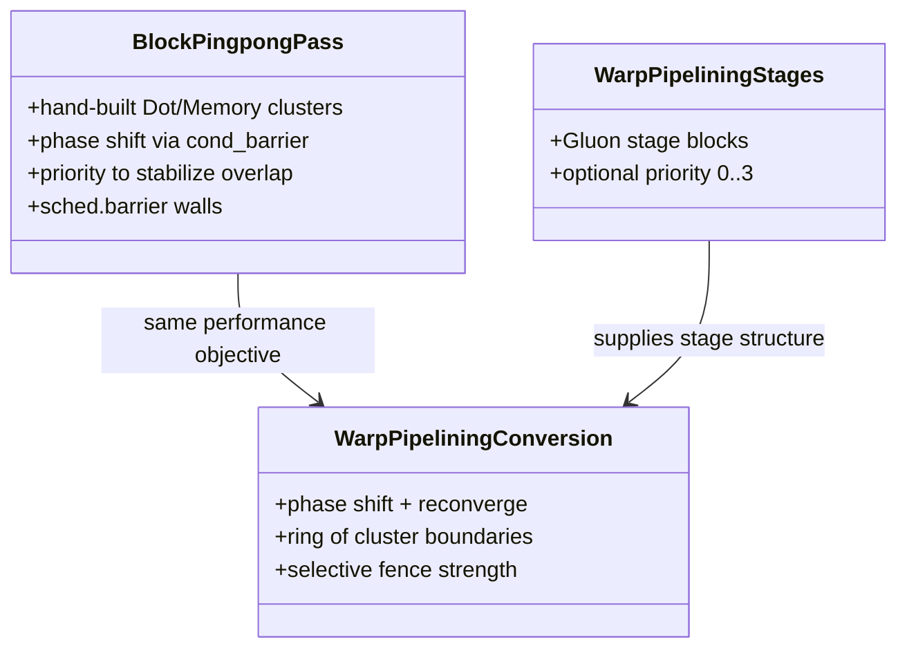

# Warp-pipelining in Triton AMDGPU

## Executive Summary

Warp-pipelining in the provided Triton AMDGPU repository is a **phase-shifted, barrier-rendezvous scheduling scheme** designed to increase **MFMA/WMMA compute utilization** in compute-bound GEMM-like kernels. It does this by forcing two warp-/wave-groups within a work-group to remain **out of phase**: while one group executes a **compute stage (MFMA-heavy)**, the other executes a **memory/prep stage (loads, LDS traffic, address updates, waits)**, then they swap. The key enabler is a *partial synchronization primitive*, `amdg.cond_barrier`, which Triton defines as a conditional execution barrier that **does not set any memory fence** and requires explicit reconvergence. citeturn0search2

The earlier BlockPingpong pass in the repo provides the clearest intent statements and concrete scheduling patterns. Its comments explain: (a) the goal is to “interleav[e]” two warps, (b) to separate “Dot and Memory clusters,” (c) to use `s_setprio` and conditional barriers for synchronization, and (d) that it primarily targets **compute-bound** regimes and relies on software pipelining rather than “improving memory latency itself.” (Repo: `third_party/amd/lib/TritonAMDGPUTransforms/BlockPingpong.cpp:L29-L37`.)

This report focuses first on **phase shift barrier rendezvous**, then analyzes the relevant BlockPingpong variants (**two**, **four**, **async**, **chained-dot**; excluding the one-cluster legacy case), and finally summarizes warp-pipelining runtime semantics, barrier/membar pitfalls, and a gfx1250 Gluon example.

## Proposed TOC

- Executive summary  
- Phase shift barrier rendezvous  
- Block-pingpong variants and performance tradeoffs  
- Warp-pipelining runtime semantics and MFMA utilization rationale  
- Barrier and membar semantics and performance pitfalls  
- Practical usage, gfx1250 Gluon example, brief implementation notes, and recommendations  

## Phase Shift Barrier Rendezvous

### Goal

The goal is to create a **stable, systematic phase offset** between two warp-/wave-groups that repeatedly rendezvous at cluster boundaries but do *not* run the same stage at the same time. In BlockPingpong, the cluster-barrier comment explains the intended steady-state: when a cluster boundary is hit, one half is at the dot cluster while the other half is at the memory cluster (Repo: `third_party/amd/lib/TritonAMDGPUTransforms/BlockPingpong.cpp:L167-L173`). Warp-pipelining implements the same idea as a stage schedule.

### Short alternative names

Besides “phase shift barrier rendezvous,” short (3–6 chars) alternatives commonly used in compiler/scheduling discussions include:

Skew, Shift, Lag, Phase, Offset.

### Repo micro-quotes from BlockPingpong comments

To anchor interpretation in the repo’s own stated intent, here are prioritized micro-quotes (each ≤25 words; shown as short phrases) with exact file and line ranges:

| Micro-quote | Source |
|---|---|
| “interleaving the execution of two warps” | `third_party/amd/lib/TritonAMDGPUTransforms/BlockPingpong.cpp:L30-L32` |
| “Dot and Memory clusters” | `third_party/amd/lib/TritonAMDGPUTransforms/BlockPingpong.cpp:L31-L33` |
| “amdg.cond_barrier” | `third_party/amd/lib/TritonAMDGPUTransforms/BlockPingpong.cpp:L33-L34` |
| “pattern can be broken” | `third_party/amd/lib/TritonAMDGPUTransforms/BlockPingpong.cpp:L54-L60` |
| “cannot include wait” | `third_party/amd/lib/TritonAMDGPUTransforms/BlockPingpong.cpp:L607-L610` |
| “higher priority to memory clusters” | `third_party/amd/lib/TritonAMDGPUTransforms/BlockPingpong.cpp:L671-L674` |

### Prototype mechanism as a universal rendezvous pattern

The repo includes an early prototype note describing “converging at a barrier from different program points” and achieving synchronization by reaching the “same barrier PC” even via different edges. (Local file: `/mnt/data/block_pingpong_early_implementation.md:L1-L16`.)

This is a universal pattern whenever the barrier is a **rendezvous**: early arrivals wait; late arrivals eventually reach the same rendezvous; then all proceed. The key restriction is that participating threads must encounter barriers (and barrier-like regions) in the same order, otherwise deadlock/undefined behavior is possible. citeturn9search0turn9search6

### Explicit prototype proof sketch

A minimal LLVM-like IR sketch representing “conditional branch + barrier rendezvous”:

```llvm
; %late partitions the team into early vs late arrivals
br i1 %late, label %park, label %cont

park:
  call void @barrier_exec()     ; execution rendezvous
  br label %cont

cont:
  ; ... extra work for early arrivals ...
  call void @barrier_exec()     ; shared rendezvous point
  ; ... continue ...
```

**Why it rendezvous:** if the barrier is a team rendezvous, the early group blocks at `@barrier_exec()` until the remaining participants arrive at the same barrier instance; then everyone proceeds. That’s the conventional definition of a barrier. citeturn9search1turn9search6

**Deadlock/undefined-behavior conditions:** if some threads take a path that reaches the barrier while others permanently miss it (or reach a different barrier first), the program can hang or become unspecified/undefined. citeturn9search0turn9search6

### How BlockPingpong uses phase shift barrier rendezvous

BlockPingpong wraps the loop with conditional barriers to create the phase offset: it “hold[s] half of the warps … before the loop” and then “hold[s] proceeding warps … after the loop” (Repo: `third_party/amd/lib/TritonAMDGPUTransforms/BlockPingpong.cpp:L914-L917`). The key semantic point matches Triton’s definition of `amdg.cond_barrier`: it conditionally executes a barrier, deliberately diverges execution, requires explicit reconvergence, and **does not set any memory fence**. citeturn0search2

### How warp-pipelining realizes phase shift barrier rendezvous

Warp-pipelining uses the same concept in a stage-driven form:

- Pre-loop: ensure outstanding synchronization is resolved, then phase-shift one group with `amdg.cond_barrier`. (Repo: `third_party/amd/lib/TritonAMDGPUToLLVM/ConvertWarpPipeline.cpp:L138-L158`.)  
- In-loop: keep groups phase-locked by repeatedly placing cluster boundaries; the conversion emits a **scheduler barrier** and then either a **local-fencing barrier** or an **execution rendezvous barrier** depending on dependence requirements. (Repo: `ConvertWarpPipeline.cpp:L83-L91`.)  
- Post-loop: reconverge the phase shift with a complementary `amdg.cond_barrier`. (Repo: `ConvertWarpPipeline.cpp` post-loop insertion; same design as BlockPingpong’s wrap.)  

The same Triton op semantics apply: `amdg.cond_barrier` is a partial synchronization tool and it explicitly has **no memory fence**. citeturn0search2

## Block-pingpong variants and performance tradeoffs

This section covers only the requested variants (**two**, **four**, **async**, **chained-dot**) and explicitly excludes the one-cluster legacy case. It also excludes any `sched_group_barrier`-based variant by request.

### Two-cluster pingpong

**Intent:** It targets the “medium sized tile” regime between the one- and four-cluster schedules. (Repo: `third_party/amd/lib/TritonAMDGPUTransforms/BlockPingpong.cpp:L585-L587`.)

**Compute–memory overlap mechanism:** slice dot/LDS loads into two parts, and place a memory cluster that interleaves some local/global ops before dot0, then dot0, then a barrier, then memory1+dot1. (Repo: structure visible immediately after `transformTwoPPClusters` begins, `L588+`.)

**Primitives used:**  
- `rocdl.s.setprio` (mapped to ISA `S_SETPRIO`) to keep the pattern stable by preventing overtaking when two warps contend for the same instruction unit. (Repo: `BlockPingpong.cpp:L54-L60`; ISA semantics: `S_SETPRIO` modifies wave priority 0–3. citeturn5view1)  
- `rocdl.sched.barrier` with mask 0 to freeze backend scheduling across boundaries. Mask guidance is documented in LLVM’s sched.barrier review: mask 0 blocks instructions crossing the barrier during scheduling. citeturn0search6  
- `amdg.cond_barrier` around the loop to phase-shift and reconverge. (Repo: `BlockPingpong.cpp:L914-L945`; op semantics. citeturn0search2)

**Key tradeoff/risk: membar/wait placement**  
This variant explicitly avoids inserting a local-fencing barrier at a particular boundary because it would pull in waits related to local loads (“cannot include wait … inserted by the ttg.barrier”). (Repo: `BlockPingpong.cpp:L607-L610`.) The performance risk is that if later passes materialize local-memory fences or waits inside the compute slice, MFMA continuity can fragment.

### Four-cluster pingpong

**Intent:** It is used when the dot tile is large enough that a single dot cluster would require too many registers; it slices dot into four pieces and pairs each with reordered memory clusters. (Repo: `BlockPingpong.cpp:L504-L507`.)

**Compute–memory overlap mechanism:** shorter compute slices (dot0..dot3) interleaved with memory phases (mem0..mem3) provide more opportunities for the hardware to overlap memory/prep work with MFMA-heavy compute and reduce live-range pressure per compute slice.

**Primitives used (explicitly documented):** The comment lists three “guards” at each cluster boundary:  
- `sched.barrier` mask 0 to prevent backend reordering across the boundary. (Repo: `BlockPingpong.cpp:L508-L510`; LLVM mask behavior. citeturn0search6)  
- `ttg.barrier` for synchronization/ordering at each point (in this implementation: local-fencing barrier op inserted). (Repo: `BlockPingpong.cpp:L511-L513`; `ttg.barrier` semantics. citeturn0search1)  
- `setprio (1->0)` to reduce overtaking/resource contention during co-execution. (Repo: `BlockPingpong.cpp:L512-L513`; ISA semantics. citeturn5view1)

**Key tradeoff/risk:** More boundaries increase overhead and increase sensitivity to any later insertion/motion of wait instructions (`S_WAITCNT`-like) into compute slices; AMD ISA explicitly notes that some dependencies must be explicitly handled with wait instructions. citeturn5view2

### Async two-cluster (scaled-dot + async copy specialization)

**Intent:** “first cluster with async copy only … second cluster with all the other ops,” requiring a second lowering step that splits dot into two mfma groups so `ds_read` stays with the first group. (Repo: `BlockPingpong.cpp:L641-L645`.)

**Compute–memory overlap mechanism:** isolate async copy (and inherent completion management) from the bulk compute region, then rely on controlled lowering to keep LDS reads in a predictable position relative to MFMA.

**Primitives used:**  
- Phase shift with `amdg.cond_barrier` via `addAsymmetricSyncToLoop` (called after this transform triggers under specific shape/element-width conditions). (Repo: selection and call: `BlockPingpong.cpp:L1029-L1047`; barrier semantics. citeturn0search2)  
- Boundary freezing with `rocdl.sched.barrier` and a rendezvous barrier. (Repo: `BlockPingpong.cpp:L659-L661`; scheduler barrier docs. citeturn0search6)  

**Key tradeoff/risk:** This variant is coupled to backend lowering (“requires additional second step”), so performance stability depends on that lowering remaining aligned with the scheduling intent. It is also highly sensitive to where any memory-fence or wait gets placed relative to MFMA slices.

### Chained-dot schedule (two compute + two memory clusters, num_stages==4)

**Intent:** It assumes pipeliner already ordered ops correctly and focuses on barriers/sched.barriers at boundaries plus higher priority for memory clusters. (Repo: `BlockPingpong.cpp:L671-L675`.)

**Compute–memory overlap mechanism:** keep compute clusters “clean” and ensure the memory cluster can always issue its necessary VALU address-update instructions even while compute is MFMA-heavy. The comment explains why: both clusters contain `v_xxx` (VALU); if compute has higher priority, it can monopolize those issue slots and eliminate overlap. (Repo: `BlockPingpong.cpp:L683-L697`.)

**Primitives used:**  
- `s_setprio` to give memory cluster higher priority. (Repo: `BlockPingpong.cpp:L681-L697`; priority semantics. citeturn5view1)  
- `s_waitcnt` placement discipline: place `s_waitcnt lgkmcnt(0)` at the end of the memory cluster to prevent the backend from inserting waits inside compute. (Repo: `BlockPingpong.cpp:L730-L743`; AMD wait semantics. citeturn5view2)  
- `rocdl.s.barrier` inserted at the beginning of the loop (not the end) to avoid backend moving loop-control scalar ops into compute. (Repo: `BlockPingpong.cpp:L834-L838`; ISA `S_BARRIER` definition. citeturn5view2)  
- Phase shift via `addAsymmetricSyncToLoop`. (Repo: `BlockPingpong.cpp:L1002-L1012` plus `L914-L945`; cond-barrier semantics. citeturn0search2)

**Key tradeoff/risk: membar/wait interference**  
The implementation explicitly notes that membar can reorder the desired start-of-cluster sequencing: membar moves `s_waitcnt` before `s_barrier` (Repo: `BlockPingpong.cpp:L784-L791`). That is a performance risk because it can blur the intended separation between memory and compute phases.

## Warp-pipelining runtime semantics and MFMA utilization rationale

Warp-pipelining keeps the same performance target as pingpong—stable compute/memory overlap—while expressing it as **stages** that lower to a phase-shifted schedule.

### Runtime semantics in one paragraph

In the conversion pass, each warp-pipelining cluster boundary is emitted as: a scheduler boundary, then either a **local-fencing barrier** (when `needLocal`) or an **execution rendezvous** barrier (when not), then another scheduler boundary (Repo: `third_party/amd/lib/TritonAMDGPUToLLVM/ConvertWarpPipeline.cpp:L83-L91`). The conversion also computes a pipeline group size and states its conceptual model: a block runs on 4 SIMDs with 2 warps per SIMD, and warp-pipelining splits them into two groups that execute different stages at different times (Repo: `ConvertWarpPipeline.cpp:L371-L375`). Finally, it wraps the loop with conditional barriers to phase-shift and reconverge. (Repo: `ConvertWarpPipeline.cpp:L138-L158`; `amdg.cond_barrier` semantics. citeturn0search2)

### Why MFMA utilization improves

Warp-pipelining’s benefit is a *scheduling shape* benefit: it tries to ensure that when one group is forced to stall (e.g., on LDS readiness or address computation), the other group can still issue MFMA-heavy work, keeping compute pipelines active. AMD ISA describes barriers as causing waves to wait until all reach the same barrier point, and it describes waits (`S_WAITCNT`) as how the program enforces certain dependency completions; both are exactly the kinds of events that can fragment MFMA issuance if placed in the wrong stage. citeturn5view2

The chained-dot commentary in BlockPingpong is especially instructive for *why priority matters*: if compute monopolizes shared VALU issue slots, the memory/prep group cannot advance its address updates, and overlap collapses. (Repo: `BlockPingpong.cpp:L689-L697`.) Warp-pipelining exposes stage-level priority as a first-class option in Gluon: priority 0–3 is lowered to `s_setprio`, is a hardware scheduling hint, and should be used judiciously. (Repo: `python/triton/experimental/gluon/language/amd/warp_pipeline.py:L17-L26`; ISA priority range. citeturn5view1)

Occupancy remains the limiting background condition: if register/LDS usage prevents multiple warps/waves from being resident, there are fewer ready instruction streams to interleave, reducing the headroom for hiding stalls. citeturn10search0turn0search1

### Mermaid pipeline timeline

Caption: green = compute stage, blue = memory/prep stage.

```mermaid
gantt
  title Warp-pipelining steady state (green=compute, blue=memory)
  dateFormat  X
  axisFormat  %L

  section Group A (early)
  Memory/Prep (blue) i       :a1, 0, 3
  Compute (green) i          :a2, 3, 3
  Memory/Prep (blue) i+1     :a3, 6, 3

  section Group B (phase-shifted)
  Phase shift (cond_barrier) :b0, 0, 3
  Memory/Prep (blue) i       :b1, 3, 3
  Compute (green) i          :b2, 6, 3
```



## Barrier and membar semantics and performance pitfalls

### Barrier taxonomy relevant to warp-pipelining

| Primitive | Intended role in warp-pipelining | Semantics anchor |
|---|---|---|
| `rocdl.s.barrier` (`S_BARRIER`) | Execution rendezvous (do not assume it orders memory by itself) | AMD ISA: `S_BARRIER` forces waves to wait until all reach barrier; surviving waves satisfy it. citeturn5view2 |
| `amdg.cond_barrier` | Conditional execution rendezvous for phase shift; requires reconvergence | Triton: similar to barrier in an if; “doesn’t set any memory fence.” citeturn0search2 |
| `ttg.barrier` | Barrier + explicit memory visibility for selected addrspaces (`none/local/...`) | TritonGPU ops: `none` is control-only; `local` makes shared-memory ops visible CTA-wide. citeturn0search1 |
| `rocdl.barrier` | Barrier with HIP `__syncthreads()` expansion | ROCDL dialect says it expands like HIP `__syncthreads()`. citeturn0search0 HIP specifies sync functions include a threadfence for visibility. citeturn10search0 |
| `gpu.barrier memfence [workgroup]` | Barrier + LDS wait/fence when required | MLIR AMDGPU docs describe `amdgpu.lds_barrier` and recommend representing it as `gpu.barrier memfence [workgroup]`. citeturn1search0 |
| `rocdl.sched.barrier` | Scheduler wall to prevent backend reordering across boundary | LLVM sched.barrier: mask 0 blocks scheduling across. citeturn0search6 |

### Ambiguous uses to flag in this repo

A critical code-level ambiguity is the distinction the warp-pipelining converter makes between **barriers that “wait local memory”** and plain execution rendezvous barriers. It explicitly accepts `ROCDL::BarrierOp` and `gpu::BarrierOp` as existing barriers between clusters, but rejects `s_barrier` and restricts multiple barriers without intervening clusters because it may cause “unpredictable timing.” (Repo: `third_party/amd/lib/TritonAMDGPUToLLVM/ConvertWarpPipeline.cpp:L180-L190`.)

Interpretation (performance-focused): this suggests the compiler authors treat *memory-waiting barriers* as semantically safe boundaries (for correctness and timing control), while treating `s_barrier` as too timing-sensitive when injected ad hoc—because it can create pipeline bubbles or re-phase the schedule unexpectedly.

### Why inserting memory fences mid-pipeline breaks pingpong overlap

The two-cluster pingpong code provides an explicit warning: inserting a local-fencing `ttg.barrier` at the wrong boundary would pull in waits associated with local loads, so the implementation uses `s_barrier` instead at that point (Repo: `BlockPingpong.cpp:L607-L610`). The chained-dot variant similarly tries to keep `S_WAITCNT` at the memory→compute boundary to prevent the backend from inserting waits inside compute. (Repo: `BlockPingpong.cpp:L730-L743`.)

These match general barrier semantics across parallel models: barriers commonly combine **execution synchronization** and **memory visibility**; but mixing them incorrectly in divergent/phase-shifted control flow can lead to deadlock or to performance collapse. citeturn9search6turn0search1turn0search2

### Membar interaction as a persistent performance risk

The repo’s membar analysis inserts `triton::gpu::BarrierOp` in local address space (Repo: `lib/Analysis/Membar.cpp:L239-L243`) and may insert a barrier after async wait (Repo: `Membar.cpp:L266-L273`). The chained-dot schedule explicitly notes the interaction: membar moves `s_waitcnt` before `s_barrier`. (Repo: `BlockPingpong.cpp:L784-L791`.) From a warp-pipelining perspective, that’s a performance hazard because it can shift wait pressure into or across intended stage boundaries.

## Practical usage, gfx1250 Gluon example, brief implementation notes, and recommendations

### Gfx1250 Gluon example in the repo

The file `third_party/amd/python/examples/gluon/f16_gemm_warp_pipeline_gfx1250.py` implements a warp-pipelined GEMM loop with explicit stage annotations:

- Triple buffering setup and initial prefetch (Repo: `.../f16_gemm_warp_pipeline_gfx1250.py:L77-L84`).  
- Stage0: LDS load grouped as a warp-pipeline stage with priority 1 (Repo: `...:L85-L88`).  
- Stage1: issue next loads and compute (WMMA) grouped as a stage with priority 0 (Repo: `...:L90-L94`).  
- Launch configuration uses `num_warps = 8` and passes `waves_per_eu = num_warps // 4` (Repo: `...:L133-L146`), matching the converter’s “two groups (one warp per SIMD)” conceptual model (Repo: `third_party/amd/lib/TritonAMDGPUToLLVM/ConvertWarpPipeline.cpp:L371-L375`).

### Brief notes on where warp-pipelining runs in the compiler

- Gluon → TTGIR: `add_warp_pipeline` runs before warp-group allocation (Repo: `third_party/amd/backend/compiler.py:L280-L293`).  
- TTGIR → LLVM: `add_warp_pipeline_conversion` runs after async-wait count updates and before `scf_to_cf` (Repo: `compiler.py:L305-L310`).  
- Frontend clustering supports deliberate “pipeline bubbles”: if a user places two stage borders back-to-back, the pass inserts a dummy cluster op (Repo: `third_party/amd/lib/TritonAMDGPUTransforms/WarpPipeliner.cpp:L145-L150`).

### Planned work

The attached internal document “Warp-Pipelining in Triton AMDGPU Backend.pdf” lists planned work including: migrating legacy Block-pingpong scheduling, developing more Gluon kernels for new architectures, parameterized automatic partitioning, and driving heuristics from empirical latency models (Local PDF: `/mnt/data/Warp-Pipelining in Triton AMDGPU Backend.pdf`, section “Future Work,” page 9 text extraction).

### Variant comparison table

| Schedule | Mechanism | Key primitives | Fence behavior risk | Robustness | Performance risk |
|---|---|---|---|---|---|
| Pingpong ×2 | Dot sliced ×2 + interleaved mem/prep | `s_setprio`, `cond_barrier`, `sched.barrier`, selective `s_barrier` | High: fence/wait can spill into compute | Medium–Low | MFMA bubbles if waits/fences land mid-compute |
| Pingpong ×4 | Dot sliced ×4 + more alternation points | `s_setprio`, `cond_barrier`, `sched.barrier`, frequent `ttg.barrier local` | Medium–High: more barriers → more wait pressure | Medium | Barrier overhead + backend motion sensitivity |
| Pingpong async | Async copy isolated; special MFMA lowering | `cond_barrier`, `sched.barrier`, rendezvous barrier | High: relies on lowering to keep LDS reads aligned | Low | Fragility to lowering + wait placement drift |
| Pingpong chained-dot | Prioritize memory + explicit wait discipline | `s_setprio`, `cond_barrier`, `s_waitcnt` placement, `sched.barrier` | Medium–High: membar can reorder waits/barriers | Medium | Overlap collapses if memory stage starves or compute polluted |
| Warp-pipelining | Phase shift + ring boundaries + stage priority | `cond_barrier`, `sched.barrier`, `s_setprio`, selective `ttg.barrier local` vs `s_barrier` | Lower in principle: fence only when needed | Higher | Misclassification of fence need or poor stage partitioning |

### Mermaid: entity relationships



### Recommendations for performance-focused use

- Treat `amdg.cond_barrier` as **execution-only phase control** (no fence). Use it to create/resolve phase shifts and rely on explicit `ttg.barrier` or `gpu.barrier memfence` only for proven memory hazards. citeturn0search2turn0search1turn1search0  
- Keep compute stages “clean”: avoid pulling `S_WAITCNT`-like waits and memory-fencing barriers into MFMA-heavy regions unless correctness demands it. AMD explicitly describes `S_WAITCNT` as required in some cases for dependency handling; placing it at boundaries allows unrelated work to run before waiting. citeturn5view2  
- Use `sched.barrier` mask 0 sparingly but decisively at stage boundaries where the backend must not reorder across; LLVM’s intrinsic is explicitly intended as a scheduling-region wall. citeturn0search6  
- Use stage priority (`s_setprio`) primarily to prevent **memory-stage starvation** when both stages require VALU address work; chained-dot’s rationale applies directly to warp-pipelining. (Repo: `BlockPingpong.cpp:L689-L697`; priority semantics. citeturn5view1)  
- Validate on representative compute-bound GEMM workloads (e.g., sufficiently large K with double/triple buffering): the scheme is designed to improve MFMA utilization, not to reduce raw memory latency. (Repo: `BlockPingpong.cpp:L35-L37`.)