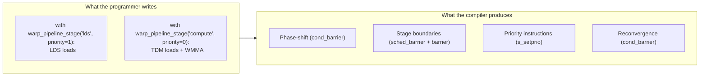
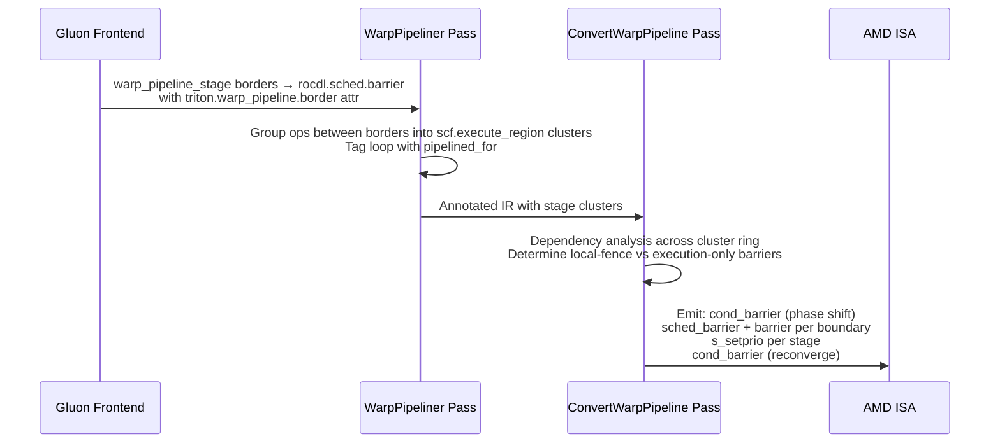
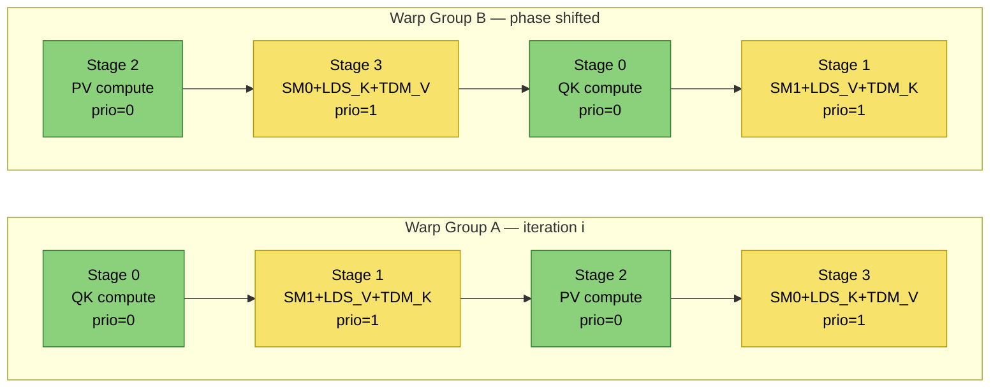
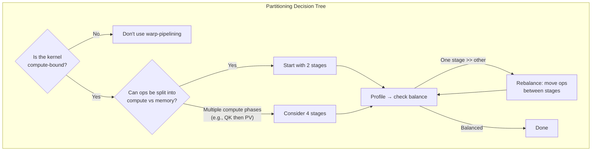
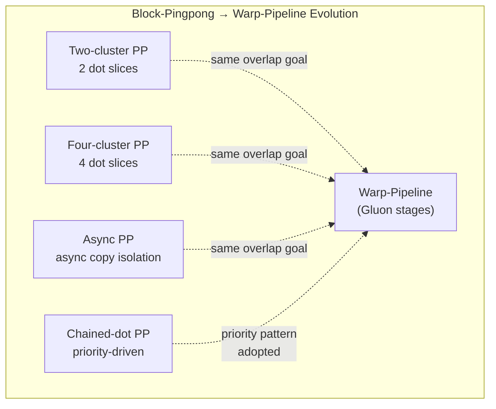
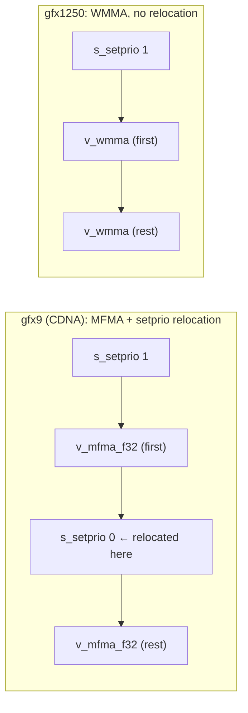

# Warp-Pipelining User Guide

Author: Jungwook Park

Note: This is the first draft of the user guide. Feedback on missing scenarios, unclear sections, or additional architecture-specific details is welcome.

## Table of Contents

- [Part 1: Programming Guide](#part-1-programming-guide)
  - [Overview](#overview)
  - [The warp\_pipeline\_stage API](#the-warp_pipeline_stage-api)
  - [Writing a warp-pipelined kernel step by step](#writing-a-warp-pipelined-kernel-step-by-step)
    - [Step 1: Identify the hot loop](#step-1-identify-the-hot-loop)
    - [Step 2: Choose how many stages](#step-2-choose-how-many-stages)
    - [Step 3: Wrap operations in stages](#step-3-wrap-operations-in-stages)
    - [Step 4: Place async waits outside stages](#step-4-place-async-waits-outside-stages)
    - [Step 5: Set up multi-buffering](#step-5-set-up-multi-buffering)
    - [Step 6: Configure launch parameters](#step-6-configure-launch-parameters)
  - [Minimal GEMM example](#minimal-gemm-example)
  - [Flash attention example (4-stage)](#flash-attention-example-4-stage)
  - [MXFP GEMM example](#mxfp-gemm-example)
  - [What NOT to do](#what-not-to-do)
- [Part 2: Performance Guide](#part-2-performance-guide)
  - [How warp-pipelining improves utilization](#how-warp-pipelining-improves-utilization)
  - [Partitioning operations into stages](#partitioning-operations-into-stages)
    - [Guiding principles](#guiding-principles)
    - [Two-stage partitioning (LDS + compute)](#two-stage-partitioning-lds--compute)
    - [Four-stage partitioning (interleaved compute and memory)](#four-stage-partitioning-interleaved-compute-and-memory)
  - [Priority assignment strategy](#priority-assignment-strategy)
  - [Reference: block-pingpong variants](#reference-block-pingpong-variants)
    - [Two-cluster pingpong](#two-cluster-pingpong)
    - [Four-cluster pingpong](#four-cluster-pingpong)
    - [Async two-cluster](#async-two-cluster)
    - [Chained-dot](#chained-dot)
  - [Barrier and fence placement](#barrier-and-fence-placement)
- [Part 3: Architecture Differences — gfx9 vs gfx12 (gfx1250)](#part-3-architecture-differences--gfx9-vs-gfx12-gfx1250)
  - [Wavefront size and pipeline group size](#wavefront-size-and-pipeline-group-size)
  - [Compute instructions: MFMA vs WMMA](#compute-instructions-mfma-vs-wmma)
  - [Wait instructions](#wait-instructions)
  - [LDS capacity and features](#lds-capacity-and-features)
  - [Priority and setprio interaction with compute lowering](#priority-and-setprio-interaction-with-compute-lowering)
  - [Summary table](#summary-table)
  - [Porting checklist: gfx9 to gfx1250](#porting-checklist-gfx9-to-gfx1250)
- [Appendix: What would help improve this guide](#appendix-what-would-help-improve-this-guide)

---

## Part 1: Programming Guide

### Overview

Warp-pipelining is a **user-directed scheduling technique** where the programmer partitions a loop body into stages, and the compiler arranges two warp groups to execute those stages out-of-phase. While one group runs a compute-heavy stage (MFMA/WMMA), the other runs a memory/prep stage (global loads, LDS traffic, address math), then they swap. This overlap keeps compute pipelines active during stalls that would otherwise leave them idle.

The Gluon API provides `warp_pipeline_stage` as the primary interface. The programmer's job is to:

1. Identify which operations form each stage.
2. Wrap them in `with warp_pipeline_stage(...)` blocks.
3. Set appropriate priorities and multi-buffering.

The compiler then handles phase-shifting, barrier insertion, and dependency analysis automatically.



### The warp_pipeline_stage API

```python
from triton.experimental.gluon.language.amd import warp_pipeline_stage

with warp_pipeline_stage(label, *, priority=None):
    # operations belonging to this stage
    ...
```

**Parameters:**

| Parameter | Type | Description |
|-----------|------|-------------|
| `label` | `str` or `None` | Human-readable stage name for diagnostics (e.g., `"load"`, `"compute"`). Does not affect semantics. |
| `priority` | `int` or `None` | Hardware scheduling hint, 0 (lowest) to 3 (highest). Maps to `s_setprio` on AMD GPUs. Optional. |

**Semantics:**
- Each `with` block defines a **pipeline cluster** — a group of operations that execute as a unit.
- The boundary between consecutive stages is where the compiler inserts synchronization (barriers, scheduler fences).
- If **any** stage in the loop specifies a priority, stages without explicit priority reset to 0.
- Stages must appear directly inside a `for`/`range` loop body.

**Import paths:**

```python
# Full path
from triton.experimental.gluon.language.amd import warp_pipeline_stage
# Via namespace
import triton.experimental.gluon.language as gl
with gl.amd.warp_pipeline_stage("load", priority=1):
    ...

# Or via ttgl
import triton.experimental.gluon.language as ttgl
with ttgl.amd.warp_pipeline_stage("compute", priority=0):
    ...
```

### Writing a warp-pipelined kernel step by step

#### Step 1: Identify the hot loop

Warp-pipelining targets the main iteration loop of compute-bound kernels (GEMM, attention, etc.). Start with a working, non-pipelined kernel and identify the `for` loop that dominates execution time.

```python
# The loop to pipeline — this is your starting point
for k in range(0, K_ITERS):
    # global loads (async)
    issue_loads(...)
    async_wait(...)
    # LDS → register loads
    a = a_buffer.index(k % NUM_BUFFERS).load(layout=...)
    b = b_buffer.index(k % NUM_BUFFERS).load(layout=...)
    # compute
    acc = wmma(a, b, acc)
```

#### Step 2: Choose how many stages

The number of stages determines the granularity of overlap. Common choices:

| Stages | Pattern | When to use |
|--------|---------|-------------|
| 2 | LDS-load \| TDM+Compute | Most GEMMs. Simple and effective. |
| 4 | (QK-compute \| SM+LDS-V+TDM \| PV-compute \| SM+LDS-K+TDM) | Attention kernels with multiple dependent compute phases. |

More stages give finer overlap but increase barrier overhead and register pressure.

#### Step 3: Wrap operations in stages

Place each group of operations inside a `warp_pipeline_stage` context manager.

```python
for k in range(0, K_ITERS):
    with gl.amd.warp_pipeline_stage("lds_load", priority=1):
        a = a_buffer.index(consumer % NUM_BUFFERS).load(layout=dot_layout_a)
        b = b_buffer.index(consumer % NUM_BUFFERS).load(layout=dot_layout_b)
        consumer += 1

    with gl.amd.warp_pipeline_stage("tdm_and_compute", priority=0):
        issue_loads(producer, ...)  # next iteration's global→LDS
        producer += 1
        acc = gl.amd.gfx1250.wmma(a, b, acc)
```

#### Step 4: Place async waits outside stages

Async wait operations (`tdm.async_wait`, `AsyncWaitOp`) **must be placed between stages, not inside them**. The compiler treats them as inter-cluster synchronization points.

```python
for k in range(0, K_ITERS):
    with gl.amd.warp_pipeline_stage("lds", priority=1):
        a, b = load_from_lds(consumer, ...)
        consumer += 1

    # async_wait sits BETWEEN stages — correct
    gl.amd.gfx1250.tdm.async_wait(0)

    with gl.amd.warp_pipeline_stage("compute", priority=0):
        issue_global_loads(producer, ...)
        acc = wmma(a, b, acc)
```

#### Step 5: Set up multi-buffering

Warp-pipelining requires at least double buffering (triple is common) so that the producer warp group can write to one buffer while the consumer reads from another.

```python
NUM_BUFFERS = 3  # triple buffering

a_buffer = gl.allocate_shared_memory(
    dtype, shape=[NUM_BUFFERS] + block_shape, layout=shared_layout)

# Prologue: prefetch first (NUM_BUFFERS - 1) tiles
for _ in gl.static_range(NUM_BUFFERS - 1):
    producer = issue_loads(producer, ...)

# Wait for the first prefetch to complete
gl.amd.gfx1250.tdm.async_wait((NUM_BUFFERS - 2) * loads_per_iter)

# Main loop with warp pipeline stages
for k in range(0, loop_bound):
    with gl.amd.warp_pipeline_stage("lds", priority=1):
        ...
    gl.amd.gfx1250.tdm.async_wait(...)
    with gl.amd.warp_pipeline_stage("compute", priority=0):
        ...

# Epilogue: drain remaining buffers without warp pipelining
for i in gl.static_range(NUM_BUFFERS - 1):
    gl.amd.gfx1250.tdm.async_wait(...)
    consume_tile(...)
```

The prologue/epilogue pattern is critical: the main warp-pipelined loop processes `K_ITERS - (NUM_BUFFERS - 1)` iterations, and the remaining tiles are consumed sequentially after the loop.

#### Step 6: Configure launch parameters

Warp-pipelining splits a workgroup into **two pipeline groups**. The expected configuration:

```python
num_warps = 8            # 8 warps total, split into 2 groups of 4
waves_per_eu = num_warps // 4  # = 2, one per pipeline group

kernel[grid](...,
    num_warps=num_warps,
    waves_per_eu=waves_per_eu)
```

The converter computes `threadsPerPipelineGroup = warp_size * 4`:
- **gfx9 (CDNA):** 64 lanes/warp × 4 = 256 threads per group
- **gfx1250:** 32 lanes/warp × 4 = 128 threads per group

### Minimal GEMM example

This is a complete two-stage warp-pipelined GEMM (simplified from `f16_gemm_warp_pipeline_gfx1250.py`):

```python
@gluon.jit
def gemm_warp_pipelined(a_ptr, b_ptr, c_ptr, M, N, K, ...):
    # Setup: layouts, tensor descriptors, shared memory buffers
    a_buffer = gl.allocate_shared_memory(...)   # [NUM_BUFFERS, BLOCK_M, BLOCK_K]
    b_buffer = gl.allocate_shared_memory(...)   # [NUM_BUFFERS, BLOCK_N, BLOCK_K]
    acc = gl.zeros((BLOCK_M, BLOCK_N), dtype=gl.float32, layout=WMMA_LAYOUT)

    # Prologue: prefetch (NUM_BUFFERS - 1) tiles
    for _ in gl.static_range(NUM_BUFFERS - 1):
        producer = issue_loads(producer, a_desc, b_desc, a_buffer, b_buffer, ...)

    # Wait for the first prefetch
    gl.amd.gfx1250.tdm.async_wait((NUM_BUFFERS - 2) * 2)

    # ── Main loop with warp pipelining ──
    for _ in range(0, gl.cdiv(K, BLOCK_K) - (NUM_BUFFERS - 1)):

        with gl.amd.warp_pipeline_stage("stage0", priority=1):
            #  LDS → register loads
            consumer, a, b = lds_load(consumer, a_buffer, ..., b_buffer, ...)

        gl.amd.gfx1250.tdm.async_wait(0)

        with gl.amd.warp_pipeline_stage("stage1", priority=0):
            # Next iteration's global → LDS loads
            producer = issue_loads(producer, a_desc, b_desc, a_buffer, b_buffer, ...)
            # Compute
            acc = gl.amd.gfx1250.wmma(a, b, acc)

    # Epilogue: drain remaining tiles (no warp pipelining)
    for i in gl.static_range(NUM_BUFFERS - 1):
        gl.amd.gfx1250.tdm.async_wait(...)
        consumer, acc = issue_wmma(consumer, a_buffer, ..., b_buffer, ..., acc, ...)

    # Store result
    gl.store(c_ptr + offs_c, acc, mask=mask_c)
```

What happens at compile time:



### Flash attention example (4-stage)

The `f16_fa_gfx1250.py` pingpong kernel uses four stages to overlap QK-compute, softmax+LDS, PV-compute, and softmax+LDS within each attention iteration:

```python
for block_id in range(block_min, block_max, BLOCK_N):
    # Stage 0: QK computation (compute-heavy)
    with gl.amd.warp_pipeline_stage("stage0", priority=0):
        qk = pgm.compute_qk_no_mask(k)

    # Async wait between stages
    gl.amd.gfx1250.tdm.async_wait(2)

    # Stage 1: Softmax part 1 + LDS load V + TDM load K (memory-heavy)
    with gl.amd.warp_pipeline_stage("stage1", priority=1):
        p, l_i, acc = pgm.softmax_part1(p, l_i, acc, alpha)
        v = pgm.v_buffer.index(iter_id % NUM_BUFFERS).load(layout=...)
        pgm.tdm_load_global_to_shared_k([t_3, 0], ...)

    # Stage 2: PV computation (compute-heavy)
    with gl.amd.warp_pipeline_stage("stage2", priority=0):
        acc = pgm.compute_pv(p, v, acc)

    # Async wait between stages
    gl.amd.gfx1250.tdm.async_wait(2)

    # Stage 3: Softmax part 0 + LDS load K + TDM load V (memory-heavy)
    with gl.amd.warp_pipeline_stage("stage3", priority=1):
        p, alpha, m_i = pgm.softmax_part0(qk, m_i)
        k = pgm.k_buffer.index(iter_id % NUM_BUFFERS).permute([1, 0]).load(...)
        pgm.tdm_load_global_to_shared_v([t_2, 0], ...)
        iter_id += 1
```

The stage assignment pattern alternates compute-heavy (priority=0) and memory-heavy (priority=1) stages:



### MXFP GEMM example

The `mxfp_gemm_gfx1250.py` shows a two-stage pattern for scaled GEMM with MXFP data types. The key difference is that LDS loads are heavier (A, B, A-scale, B-scale), so the memory stage has more work:

```python
def warp_pipeline(self, K):
    # Prologue: prefetch (NUM_BUFFERS - 1) tiles
    for _ in gl.static_range(cfg.NUM_BUFFERS - 1):
        load_idx = self.issue_loads(load_idx, ...)

    gl.amd.gfx1250.tdm.async_wait(...)

    for _ in range(0, loop_ub):
        # Stage: LDS loads (A, B, scales) — memory-heavy, higher priority
        with gl.amd.warp_pipeline_stage("lds", priority=1):
            a, b, scale_a, scale_b = self.issue_local_loads(wmma_idx, ...)
            wmma_idx += 1

        gl.amd.gfx1250.tdm.async_wait(...)

        # Stage: TDM global loads + WMMA compute — compute-heavy, lower priority
        with gl.amd.warp_pipeline_stage("tdm+wmma", priority=0):
            load_idx = self.issue_loads(load_idx, ...)
            acc = gl.amd.gfx1250.wmma_scaled(a, scale_a, ..., b, scale_b, ..., acc)

    # Epilogue
    ...
```

### What NOT to do

These are common mistakes that will cause compilation failure or silent performance loss.

#### 1. Do NOT place barriers or waits inside a stage

The compiler expects async waits and barriers **between** stages, not inside them. Placing them inside a stage causes conversion failure.

```python
# BAD — async_wait inside a stage
with gl.amd.warp_pipeline_stage("load"):
    gl.amd.gfx1250.tdm.async_wait(0)   # WRONG: will fail conversion
    a = buffer.load(...)

# GOOD — async_wait between stages
gl.amd.gfx1250.tdm.async_wait(0)
with gl.amd.warp_pipeline_stage("load"):
    a = buffer.load(...)
```

#### 2. Do NOT put non-stage operations inside the loop body

Every operation in the pipelined loop body must be inside a `warp_pipeline_stage` block, be a recognized inter-stage op (`async_wait`, `barrier`), or be the `yield`/iterator update. Stray operations cause conversion failure.

```python
# BAD — bare operation between stages
with gl.amd.warp_pipeline_stage("stage0"):
    a = load(...)
counter += 1                              # WRONG: stray op outside any stage
with gl.amd.warp_pipeline_stage("stage1"):
    acc = compute(a, acc)

# GOOD — move it into a stage
with gl.amd.warp_pipeline_stage("stage0"):
    a = load(...)
with gl.amd.warp_pipeline_stage("stage1"):
    counter += 1
    acc = compute(a, acc)
```

#### 3. Do NOT use only one stage

A minimum of **two stages** is required for warp-pipelining to activate. A single stage means there is nothing to overlap.

```python
# BAD — single stage, no overlap possible
for k in range(0, K_ITERS):
    with gl.amd.warp_pipeline_stage("everything"):
        a = load(...)
        acc = compute(a, acc)
```

#### 4. Do NOT use `static_range` for the pipelined loop

The pipelined loop must use a dynamic `range(...)`, not `gl.static_range(...)`. The compiler looks for `scf.for` loops, which `static_range` does not produce.

```python
# BAD — static_range generates unrolled code, no scf.for
for k in gl.static_range(K_ITERS):
    with gl.amd.warp_pipeline_stage("stage0"):
        ...

# GOOD — dynamic range produces scf.for
for k in range(0, K_ITERS):
    with gl.amd.warp_pipeline_stage("stage0"):
        ...
```

#### 5. Do NOT set priority outside the valid 0–3 range

Priority maps directly to the operand of `s_setprio`. Values outside 0–3 will trigger an assertion.

#### 6. Do NOT rely on warp-pipelining for memory-bound kernels

Warp-pipelining improves **compute utilization** by hiding memory latency behind compute from another warp group. If the kernel is already memory-bound (low arithmetic intensity), adding warp-pipelining will not help and may hurt performance due to increased barrier overhead and register pressure.

#### 7. Do NOT forget the epilogue

The warp-pipelined loop processes `K_ITERS - (NUM_BUFFERS - 1)` iterations. The remaining tiles must be consumed in a sequential epilogue after the loop, without warp-pipeline stages.

```python
# After the warp-pipelined loop
for i in gl.static_range(NUM_BUFFERS - 1):
    gl.amd.gfx1250.tdm.async_wait(...)
    # Consume remaining tiles sequentially
    consumer, acc = issue_wmma(consumer, ..., acc, ...)
```

---

## Part 2: Performance Guide

### How warp-pipelining improves utilization

On AMD GPUs, a workgroup runs on 4 SIMDs with 2 warps per SIMD (8 warps total). Warp-pipelining splits these into two groups of 4 warps. At any given time:

- **Group A** executes a compute stage (WMMA/MFMA-heavy)
- **Group B** executes a memory stage (global loads, LDS reads, address math)

The phase shift ensures they alternate, so when Group A stalls on LDS readiness, Group B fills the compute pipeline, and vice versa.

```mermaid
gantt
    title Warp-Pipeline Execution Timeline
    dateFormat X
    axisFormat %s

    section Group A
    Memory/Prep i       :a1, 0, 3
    Compute i           :a2, 3, 6
    Memory/Prep i+1     :a3, 6, 9
    Compute i+1         :a4, 9, 12

    section Group B
    Phase Shift          :b0, 0, 1
    Compute i-1 (tail)   :b1, 1, 3
    Memory/Prep i        :b2, 3, 6
    Compute i            :b3, 6, 9
    Memory/Prep i+1      :b4, 9, 12
```



The benefit is a **scheduling shape** benefit: it keeps the MFMA/WMMA pipeline fed even when individual warps would stall on memory dependencies.

### Partitioning operations into stages

Partitioning is the most critical performance decision. The goal is to separate operations that compete for the same hardware resources into different stages, so the hardware can interleave them.

#### Guiding principles

1. **Separate compute from memory.** WMMA/MFMA instructions and LDS loads should be in different stages. They use different hardware units and can overlap.

2. **Keep stages roughly balanced in duration.** If one stage is much longer than the other, the shorter stage's warp group idles while waiting at the barrier.

3. **Minimize data flowing across stage boundaries.** Values produced in one stage and consumed in the next become live across the barrier, increasing register pressure.

4. **Put address arithmetic with memory, not compute.** VALU instructions for pointer updates compete with MFMA/WMMA for issue slots. Putting them in the memory stage keeps the compute stage clean.

5. **Prefer fewer stages.** Each stage boundary adds a barrier + scheduler fence. Start with 2 stages and only increase if profiling shows imbalance.



#### Two-stage partitioning (LDS + compute)

The most common pattern for GEMM. One stage loads operands from LDS into registers; the other issues global loads and computes.

```
┌─────────────────────────────────────────┐
│            Main Loop Iteration          │
├───────────────────┬─────────────────────┤
│  Stage 0 (prio=1) │  Stage 1 (prio=0)  │
│  ─────────────────│─────────────────────│
│  LDS → register   │  Global → LDS      │
│  load A tile      │  (next iteration)   │
│  load B tile      │  WMMA(A, B, acc)    │
│  [+ load scales]  │  [+ scaled WMMA]    │
├───────────────────┴─────────────────────┤
│  Group A runs Stage 0 while             │
│  Group B runs Stage 1, then they swap   │
└─────────────────────────────────────────┘
```

Why LDS loads get higher priority: the memory stage must complete LDS reads before the next compute stage can begin. Giving it higher priority (1) ensures the hardware scheduler favors it when both groups contend for VALU issue slots.

#### Four-stage partitioning (interleaved compute and memory)

For attention kernels with two compute phases (QK and PV), use four stages with alternating compute/memory:

```
┌──────────────────────────────────────────────────────┐
│              Main Loop Iteration (Attention)          │
├─────────────┬─────────────┬──────────────┬───────────┤
│ Stage 0     │ Stage 1     │ Stage 2      │ Stage 3   │
│ prio=0      │ prio=1      │ prio=0       │ prio=1    │
│─────────────│─────────────│──────────────│───────────│
│ QK compute  │ Softmax pt1 │ PV compute   │ Softmax   │
│ (WMMA)      │ LDS load V  │ (WMMA)       │ pt0       │
│             │ TDM load K  │              │ LDS load K│
│             │ (next iter) │              │ TDM load V│
│             │             │              │ (next)    │
└─────────────┴─────────────┴──────────────┴───────────┘
```

### Priority assignment strategy

The `priority` parameter maps to `s_setprio`, which is a hardware hint for wave scheduling when multiple waves contend for instruction issue slots.

**Recommended pattern:**

| Stage type | Priority | Rationale |
|-----------|----------|-----------|
| Memory/LDS-heavy | 1 (higher) | Must complete quickly so the next compute stage has operands ready. Also, address-update VALU instructions would otherwise be starved by MFMA/WMMA in the other group. |
| Compute-heavy | 0 (lower) | MFMA/WMMA instructions have long latency and pipeline deeply. They don't need priority to start — they just need to be issued. |

The chained-dot variant in BlockPingpong provides the rationale: if the compute group has higher priority, it monopolizes VALU issue slots and the memory group's address updates starve, collapsing overlap.

**When to omit priority:** If you don't specify priority on any stage, no `s_setprio` instructions are emitted. This may be appropriate when stages are well-balanced and the hardware scheduler makes good decisions on its own.

### Reference: block-pingpong variants

The legacy BlockPingpong pass implements the same overlap concept with hand-built schedules. Understanding these variants helps inform warp-pipeline stage partitioning.

#### Two-cluster pingpong

- **Pattern:** Dot sliced into 2 parts, interleaved with memory.
- **Best for:** Medium-sized tiles, compute-bound GEMM.
- **Key insight:** Avoids local-fencing barrier at one boundary to prevent wait instructions from bleeding into the compute slice.
- **Risk:** Later passes can insert memory fences that fragment MFMA continuity.

#### Four-cluster pingpong

- **Pattern:** Dot sliced into 4 parts with more alternation points.
- **Best for:** Large tiles where a single dot cluster would require too many registers.
- **Key insight:** Shorter compute slices reduce register live ranges.
- **Risk:** More barriers increase overhead; more sensitive to backend instruction motion.

#### Async two-cluster

- **Pattern:** First cluster isolates async copy; second cluster has all other ops.
- **Best for:** Async-copy-heavy paths with TDM loads.
- **Key insight:** Isolating async copy gives better control over completion management.
- **Risk:** Tightly coupled to backend lowering; fragile to wait placement changes.

#### Chained-dot

- **Pattern:** Two compute + two memory clusters; memory gets higher priority.
- **Best for:** VALU-heavy address math; must balance memory and compute.
- **Key insight:** Explicit `s_waitcnt lgkmcnt(0)` at end of memory cluster prevents backend from inserting waits inside compute.
- **Risk:** `membar` pass can reorder waits before barriers, blurring stage separation.



### Barrier and fence placement

The compiler automatically inserts barriers at stage boundaries. Understanding what gets inserted helps diagnose performance issues:

| Boundary condition | What the compiler inserts | Why |
|-------------------|--------------------------|-----|
| Stages share LDS allocations (R/W overlap) | `sched_barrier(0)` + `ttg.barrier(local)` + `sched_barrier(0)` | LDS data must be visible before the consumer stage reads it. |
| Stages have no LDS overlap | `sched_barrier(0)` + `s_barrier` + `sched_barrier(0)` | Execution rendezvous only — no memory fence needed. |
| Pre-loop | `ttg.barrier(local)` + `cond_barrier(second_half)` | Resolve outstanding sync, then phase-shift one warp group. |
| Post-loop | `cond_barrier(first_half)` | Reconverge both groups before continuing. |

**Performance rule of thumb:** fewer local-fencing barriers = better. If the compiler inserts local barriers where you don't expect them, you may have an LDS aliasing issue between stages. Try separating LDS allocations or adjusting buffer indexing so producer and consumer stages don't touch the same LDS interval simultaneously.

---

## Part 3: Architecture Differences — gfx9 vs gfx12 (gfx1250)

Warp-pipelining targets the same overlap principle on both architectures, but several hardware differences affect how kernels are written and how they perform.

### Wavefront size and pipeline group size

| Property | gfx9 (CDNA1–4) | gfx1250 |
|----------|----------------|---------|
| Wavefront (warp) size | 64 lanes | 32 lanes |
| Threads per pipeline group | 256 (64 × 4 SIMDs) | 128 (32 × 4 SIMDs) |
| Total threads for 8 warps | 512 | 256 |

The warp-pipeline conversion pass correctly scales the group size:

```cpp
int threadsPerPipelineGroup = targetInfo.getWarpSize() * 4;
```

**Impact:** gfx1250 kernels have half the threads per group. This means half the register file per group (given same occupancy), which can limit tile sizes.

**Note:** The legacy BlockPingpong pass hard-codes `256` for the group split, which assumes gfx9's 64-lane wavefronts. This means BlockPingpong's asymmetric sync does not work correctly on gfx1250; use the Gluon warp-pipeline API instead.

### Compute instructions: MFMA vs WMMA

| Property | gfx9 (CDNA) | gfx1250 |
|----------|-------------|---------|
| Matrix instruction | MFMA | WMMA |
| Typical instruction shape | 16×16×16, 32×32×8, etc. | 16×16×32 |
| `s_setprio` relocation in lowering | Yes (MFMA.cpp moves `s_setprio` after first MFMA) | **No** (WMMA.cpp has no equivalent logic) |

**Impact on priority:** On gfx9, when `s_setprio` appears immediately before a dot operation, `MFMA.cpp` automatically moves it after the first MFMA instruction so that priority takes effect during the MFMA sequence. On gfx1250, WMMA lowering does **not** do this relocation. This means the priority hint timing may differ between architectures and may need manual experimentation on gfx1250.

### Wait instructions

| Aspect | gfx9 (ISA major 9–11) | gfx1250 (ISA major ≥ 12) |
|--------|----------------------|--------------------------|
| Wait mechanism | Packed `S_WAITCNT` (vmcnt + lgkmcnt in one instruction) | Split: `WAIT_DSCNT` (LDS), `WAIT_LOADCNT` (global loads), `WAIT_STORECNT` (stores) |
| Encoding function | `encodeWaitcnt(major, vmcnt, ds)` | Direct lowering to `ROCDL::WaitDscntOp`, etc. |

**Impact:** The split wait model on gfx1250 gives finer-grained control over what the warp waits for. In theory, this should be better for warp-pipelining because you can wait for only LDS without stalling on global loads. In practice, the compiler handles this automatically, but understanding the difference helps when reading ISA output.

### LDS capacity and features

| Property | gfx9 (CDNA typical) | gfx1250 |
|----------|---------------------|---------|
| Max shared memory | 64 KiB | **320 KiB** |
| Partition size | 0 (no partitioning) | 64 KiB |
| Direct-to-LDS scattering | No | Yes |
| Direct-to-LDS load bit widths | CDNA3/4: limited set | 128, 64, 32 |
| Direct-from-LDS store | No | 128, 64, 32, 8 |
| TDM (Tensor Data Mover) | Not available | Available |

**Impact:** gfx1250's larger LDS allows more buffers or larger tiles, and TDM provides a hardware-assisted async copy mechanism that is central to the Gluon warp-pipeline examples. On gfx9, global loads and LDS stores use standard load/store instructions; on gfx1250, `tdm.async_load` moves data directly from global memory to LDS without going through registers.

### Priority and setprio interaction with compute lowering



On gfx9, MFMA lowering moves the user's `s_setprio` to **after the first MFMA**, ensuring the priority change applies during the MFMA sequence. On gfx1250, WMMA lowering applies the priority instruction as-is, without relocation. This means that on gfx1250, the priority takes effect immediately before the first WMMA rather than after it.

### Summary table

| Dimension | gfx9 (CDNA) | gfx1250 | Action for kernel author |
|-----------|-------------|---------|--------------------------|
| Warp size | 64 | 32 | Use `num_warps=8`; converter auto-scales group size |
| Compute unit | MFMA | WMMA | Use arch-appropriate dot op (`mfma` vs `wmma`) |
| setprio relocation | Automatic | None | May need to adjust priority values experimentally |
| Wait model | Packed `s_waitcnt` | Split `wait_dscnt` etc. | Transparent; compiler handles |
| LDS capacity | 64 KiB | 320 KiB | Can use larger tiles / more buffers on gfx1250 |
| Async global→LDS | Via standard loads | TDM `async_load` | Use TDM API on gfx1250 |
| BlockPingpong compat | Works (256-thread split) | **Broken** (hard-coded 256) | Use Gluon warp-pipeline API on gfx1250 |

### Porting checklist: gfx9 to gfx1250

1. **Replace `mfma` calls with `wmma` calls** (or use arch-generic dot if available).
2. **Replace standard global loads with TDM loads** (`gl.amd.gfx1250.tdm.async_load`).
3. **Replace manual async waits** with `gl.amd.gfx1250.tdm.async_wait(count)`.
4. **Increase tile sizes** if LDS allows (320 KiB vs 64 KiB).
5. **Add warp-pipeline stages** using the Gluon API (don't rely on BlockPingpong).
6. **Test priority values** — setprio behavior differs without MFMA relocation.
7. **Verify `num_warps` and `waves_per_eu`** — typical: `num_warps=8`, `waves_per_eu=2`.

---

## Appendix: What would help improve this guide

The following inputs would make this guide more complete and actionable:

### Performance data

- **Benchmark results** comparing non-pipelined vs warp-pipelined versions of the same kernel, showing cycle counts, MFMA/WMMA utilization, and LDS bank conflict rates.
- **Profiling traces** (e.g., `rocprof` or `omniperf` output) showing where stalls occur before and after warp-pipelining.
- **Sensitivity analysis** of priority values: how do different priority assignments (0/1, 0/2, 1/3) affect performance on specific kernels?

### Architecture details

- **gfx9 warp-pipelined kernel examples** using the Gluon API (current examples are all gfx1250).
- **Detailed s_setprio semantics** on gfx1250: since WMMA lowering doesn't relocate setprio, what is the actual hardware behavior? Is it effective before or only during WMMA sequences?
- **LDS partitioning behavior** on gfx1250: how does the 64 KiB partition size interact with warp-pipeline's two-group LDS access pattern?
- **Occupancy interaction**: concrete data on how register pressure from warp-pipelining (two groups of live values) affects occupancy and whether the overlap benefit compensates.

### Programming patterns

- **More complex examples**: multi-CTA (CGA) kernels with warp-pipelining, fused kernels (GEMM+epilogue), and non-GEMM workloads.
- **Anti-patterns with explanations**: real-world cases where warp-pipelining was applied and hurt performance, with diagnosis.
- **Automatic partitioning heuristics**: if/when the compiler can automatically decide stage boundaries, what heuristics should it use?
- **Stage count guidance**: empirical data on when 2 vs 3 vs 4 stages is optimal for different kernel shapes.

### Correctness

- **Dependency analysis deep dive**: step-by-step walkthrough of the circular dependency analysis in `ConvertWarpPipeline.cpp` with a concrete example showing which barriers are local-fence vs execution-only.
- **Testing methodology**: how to verify that a warp-pipelined kernel is correct (not just functionally correct, but that the overlap is actually happening as intended).
